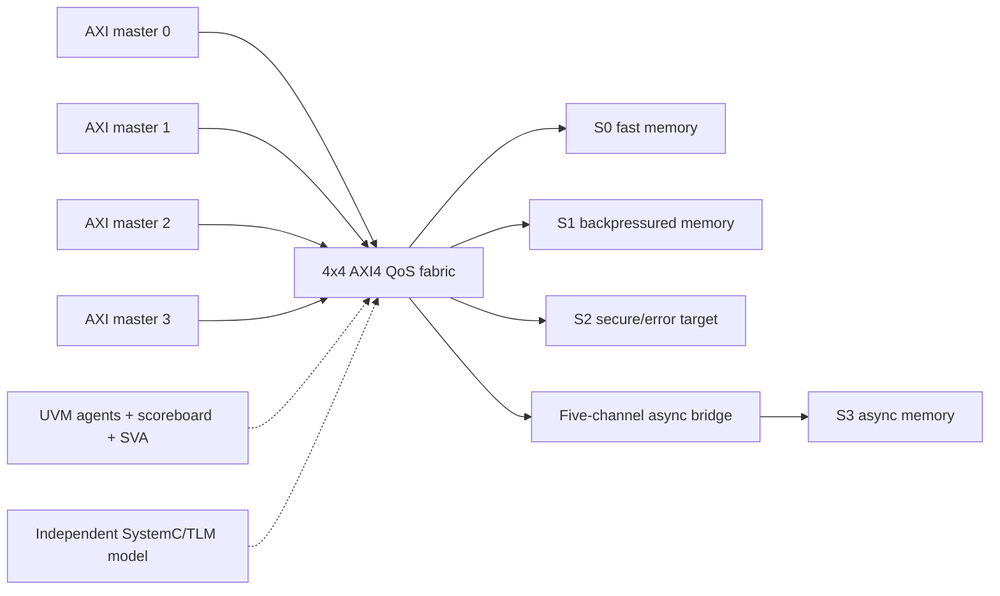

# AXI4 QoS Fabric RTL and DV Project

A standalone, synthesizable 4-initiator/4-target AXI4 shared fabric built to demonstrate SoC interconnect design and verification. The fabric implements independent read/write routing, ID ownership, four outstanding IDs per initiator, burst-locked data routing, QoS-aware round-robin arbitration with aging, static access control, local `DECERR`, and a five-channel asynchronous AXI target bridge.

This project is independent of the earlier RISC-V chiplet and L1 cache projects. No DUT RTL or reference model is reused.

## Architecture



## Executed Evidence

The repository reports measured results separately from the full release targets. Run `make reports` to refresh the current snapshot.

| Evidence | Current executable scope |
| --- | --- |
| Named integrated regression | `25 / 25` routing, burst, error, same-master outstanding-ID, contention, reset, backpressure, and CDC scenarios |
| Seeded-random stress | `100 / 100` passing manifest-driven runs with reproducible knobs and logs |
| Protocol/data smoke checks | `38 / 38` passing |
| SystemC/TLM model self-test | `7 / 7` passing |
| Full trace replay | `125 / 125` named/random traces checked for routing, beats, IDs, responses, and memory effects |
| Assertions | `27` named classes and `112` elaborated protocol/CDC instances |
| UVM runtime | `4 / 4` real phase-based tests on Verilator `v5.048`, including multi-ID traffic |
| Functional / interaction coverage | `56 / 56` bins and `46 / 46` trace-derived crosses |
| Verilator line coverage | `85.88%` raw design RTL; `93.25%` reviewed executable RTL with listed exclusions |
| Mutation detection | `6 / 6` injected faults detected |
| Integrated CDC / performance | `4 / 4` clock ratios with reset/FIFO stress; `112` per-master characterization points |
| Solver formal | `2 / 2` Yosys-SMT proof/cover groups plus bounded simulation checks |
| Implementation proxy | `2 / 2` parseable blocks synthesize and QoS gate smoke passes; full fabric remains frontend-limited |

## Supported AXI4 Subset

- 32-bit address, 64-bit data, 4-bit initiator ID.
- Four initiators and four targets by default.
- `INCR` bursts of 1-16 beats and 1/2/4/8-byte transfer sizes.
- Four distinct outstanding read IDs and four distinct outstanding write IDs per initiator.
- Out-of-order completion across IDs; contiguous beats within an R burst.
- Target ID is `{initiator_index, initiator_id}` and is restored on response.
- Invalid, unmapped, misaligned, unsupported, 4-KiB-crossing, or denied accesses complete locally with `DECERR`.
- `FIXED`, `WRAP`, exclusive, atomic, coherent, and read-interleaved transactions are outside the contract.

This is a deliberately constrained AXI4 implementation, not protocol certification or reusable commercial VIP.

## Quick Start

```bash
make lint
make model-check
VERILATOR_UVM=/path/to/verilator-v5.048/bin/verilator make uvm-smoke
VERILATOR_UVM=/path/to/verilator-v5.048/bin/verilator make release-check
```

Optional evidence:

```bash
make regress
make random-stress
make code-coverage
make formal-prove
make mutation-check
make synth-check
make equivalence-check
make gate-level-smoke
make release-check       # executable release gate; fails if any measured criterion misses its target
```

## Reviewer Path

1. [Project metrics](docs/project_metrics.md)
2. [Architecture and AXI contract](docs/architecture.md)
3. [Verification plan](docs/verification_plan.md)
4. [Requirement traceability](docs/traceability.md)
5. [UVM runtime status](docs/uvm_status.md)
6. [Coverage](docs/coverage.md)
7. [Code coverage and exclusions](docs/code_coverage.md)
8. [Performance](docs/performance.md)
9. [Implementation status](docs/implementation_status.md)
10. [Five-minute reviewer guide](docs/reviewer_guide.md)
11. [Assertion set](docs/assertions.md)
12. [Bug diary](docs/bug_diary.md)
13. [Formal evidence](docs/formal.md)

## Tool and Signoff Boundaries

The default flow uses Verilator, SystemC 2.3.4, Python, C++, Yosys, Yosys-SMTBMC, and Z3. UVM uses Verilator `v5.048` and `uvm-verilator` commit `656f20d087370a7c742e00188d20bbf30fa95339`; older local builds are not accepted as equivalent runtime evidence. Results are open-source engineering evidence, not AXI certification, CDC signoff, timing signoff, or commercial formal closure. Solver-backed proof currently covers the QoS arbiter; full-fabric formal, synthesis, and sequential equivalence remain explicitly frontend-limited. Unexecuted work is labeled `PARTIAL` or `SKIP`, never as passing evidence.
