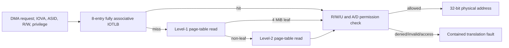

# Optional DMA IOMMU and IOTLB

This standalone block demonstrates DMA address translation and protection without changing the closed AXI fabric interface. It is optional integration collateral rather than part of the canonical fabric regression.

## Design Scope

- Sv32-inspired two-level page walks with 4 KiB pages and level-1 superpages.
- Eight round-robin-replaced IOTLB entries tagged by ASID.
- Read, write, user, accessed, and dirty permission enforcement.
- Targeted ASID and global invalidation.
- One translation outstanding at a time with independent page-walk request/response backpressure.
- Invalid-PTE, permission, and page-walk access fault classes; fault responses never expose a translated physical address.

## Verification Evidence

`make iommu-check` runs `25` checked translations and closes `19 / 19` targeted points. The matrix covers hit/miss behavior, level-2 and superpage walks, read/write/user permissions, invalid entries at both levels, access errors, ASID isolation, targeted/global invalidation, replacement, and both request and response backpressure.

Six named assertions protect page-walk and response stability, fault containment, response accounting, invalidation exclusion, and walk ownership. Current counters record five TLB hits, twenty misses, thirty-seven page-table reads, and five intentionally contained faults in the directed matrix. See [summary](../reports/iommu_summary.csv) and [coverage](../reports/iommu_coverage.csv).

The PTE format is an educational Sv32-like subset. This is not an Arm SMMU, RISC-V IOMMU compliance implementation, ATS/PRI support, or a commercial translation/security signoff claim.
